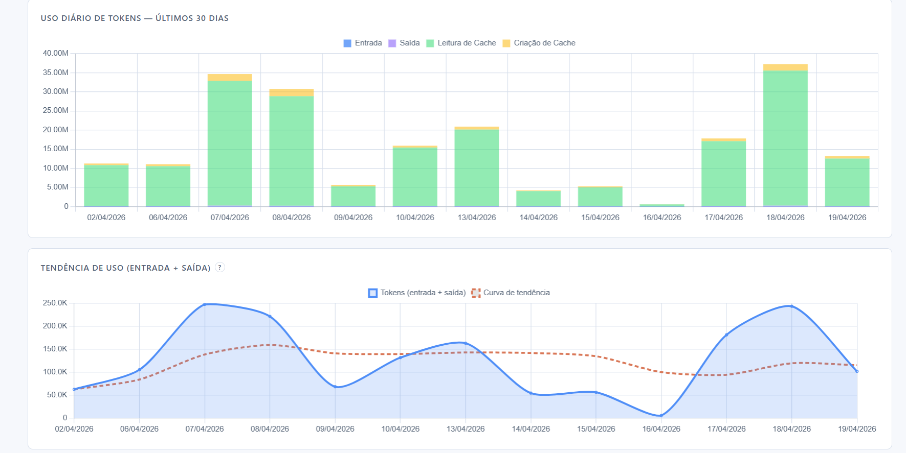
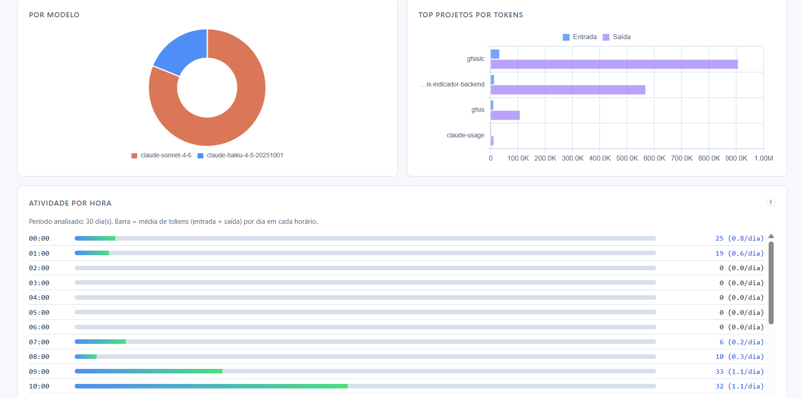
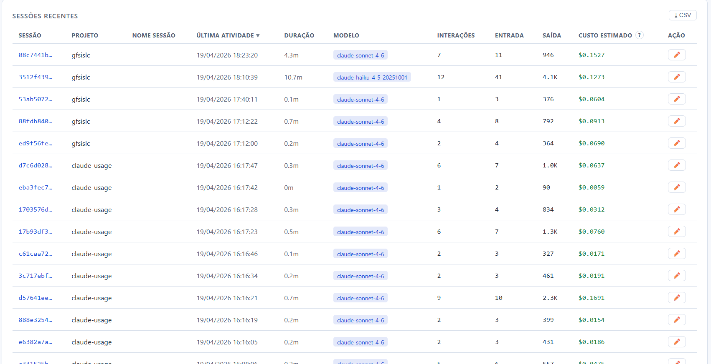
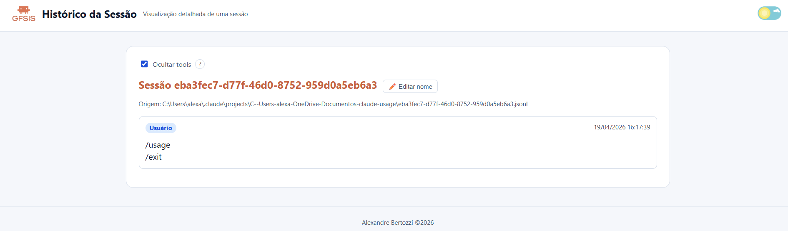

# Painel de Uso do Claude Code

[](LICENSE)
[](https://claude.ai/code)

O Claude Code grava logs locais detalhados de uso — contagem de tokens, modelos, sessões e projetos — independentemente do seu plano. Este dashboard lê esses logs e os transforma em gráficos e estimativas de custo. Funciona com planos API, Pro e Max.







---

## Destaques desta versão

- Possibilidade de **editar sessão**
- **Página de sessão** para exibir o **histórico da sessão**
- **Gráfico de tendência de consumo**
- **Quadro com insights**
- **Filtro por vários períodos**
- Inclusão de **logomarca** no projeto
- **Labels traduzidos para PT-BR**
- **Atualização automática a cada 30 segundos** no dashboard
- **Pausa da atualização automática da página** (com opção de retomar)
- Suporte a **tema claro e escuro**
- Criação de **paginação na lista de sessões**
- **Lista de mensagens por hora**

---

## O que este projeto monitora

Funciona nos planos **API, Pro e Max** — o Claude Code grava logs locais de uso independentemente do tipo de assinatura. Esta ferramenta lê esses logs e oferece visibilidade que a interface da Anthropic não fornece.

Captura uso de:
- **Claude Code CLI** (comando `claude` no terminal)
- **Extensão do VS Code** (barra lateral do Claude Code)
- **Sessões do Dispatched Code** (sessões roteadas pelo Claude Code)

**Não é capturado:**
- **Sessões Cowork** — são executadas no servidor e não gravam transcrições JSONL locais
- **Sessões do Claude Web e aplicativo desktop** — ainda não disponíveis nas transcrições locais do Claude Code

---

## Requisitos

- Python 3.8+
- Nenhum pacote de terceiros — usa apenas a biblioteca padrão (`sqlite3`, `http.server`, `json`, `pathlib`)

> Quem já usa Claude Code já tem Python instalado.

## Início rápido

Sem `pip install`, sem ambiente virtual, sem etapa de build.

### Windows
```
git clone https://github.com/phuryn/claude-usage
cd claude-usage
python cli.py dashboard
```

### macOS / Linux
```
git clone https://github.com/phuryn/claude-usage
cd claude-usage
python3 cli.py dashboard
```

### Docker (opcional)
```bash
git clone https://github.com/phuryn/claude-usage
cd claude-usage
docker compose up --build
```

> O `docker-compose.yml` monta `${HOME}/.claude` em `/root/.claude` dentro do container para que o scanner leia os JSONLs e escreva `usage.db` no mesmo local esperado pela aplicação.

---

## Uso

> No macOS/Linux, use `python3` em vez de `python` em todos os comandos abaixo.

```
# Varre arquivos JSONL e popula o banco de dados (~/.claude/usage.db)
python cli.py scan

# Mostra o resumo de uso de hoje por modelo (no terminal)
python cli.py today

# Mostra estatísticas de todo o período (no terminal)
python cli.py stats

# Mostra insights acionáveis (últimos 14 dias)
python cli.py insights

# Executa scan + abre o dashboard no navegador em http://localhost:8082
python cli.py dashboard

# Abre uma aba dedicada que captura "claude" + "/usage" (scraping de curto prazo)
python cli.py live-usage

# Host e porta personalizados via variáveis de ambiente
HOST=0.0.0.0 PORT=9000 python cli.py dashboard

# Porta da aba de live usage (padrão: 8787)
LIVE_USAGE_PORT=9090 python cli.py live-usage

# Varre um diretório de projetos personalizado
python cli.py scan --projects-dir /caminho/para/transcripts

# Exporta relatório (JSON + Markdown) dos últimos 7 dias
python cli.py export --format both --period 7d --output ./reports/uso-semanal

# Exporta somente JSON de intervalo customizado
python cli.py export --format json --period custom --start 2026-04-01 --end 2026-04-15 --output ./reports/quinzena.json
```

O scanner é incremental — ele rastreia o caminho e o tempo de modificação de cada arquivo, então rodar `scan` novamente é rápido e processa apenas arquivos novos ou alterados.

Por padrão, o scanner verifica `~/.claude/projects/` e também o diretório de integração Claude no Xcode (`~/Library/Developer/Xcode/CodingAssistant/ClaudeAgentConfig/projects/`), ignorando os que não existirem. Use `--projects-dir` para varrer um local personalizado.

---

## Como funciona

O Claude Code grava um arquivo JSONL por sessão em `~/.claude/projects/`. Cada linha é um registro JSON; registros do tipo `assistant` contêm:
- `message.usage.input_tokens` — tokens brutos do prompt
- `message.usage.output_tokens` — tokens gerados
- `message.usage.cache_creation_input_tokens` — tokens gravados no cache de prompt
- `message.usage.cache_read_input_tokens` — tokens servidos a partir do cache de prompt
- `message.model` — modelo utilizado (ex.: `claude-sonnet-4-6`)

O `scanner.py` processa esses arquivos e armazena os dados em um banco SQLite em `~/.claude/usage.db`.

O `dashboard.py` serve um dashboard de página única em `localhost:8082` com gráficos Chart.js (carregados via CDN). Ele se atualiza automaticamente a cada 30 segundos, com opção de pausar/retomar a atualização automática da página, e suporta filtro por modelo com URLs que podem ser salvas/favoritadas. O dashboard também aplica **loading inicial** ao abrir a página e **loading de navegação** ao trocar de rota/tela interna para dar feedback visual durante carregamentos. O endereço de bind e a porta podem ser sobrescritos com variáveis de ambiente `HOST` e `PORT` (padrões: `localhost`, `8082`).

---

## Estimativas de custo

Os custos são calculados com base nos **preços de API da Anthropic em abril de 2026** ([claude.com/pricing#api](https://claude.com/pricing#api)).

**Apenas modelos cujo nome contém `opus`, `sonnet` ou `haiku` são incluídos nos cálculos de custo.** Modelos locais, desconhecidos e quaisquer outros nomes de modelo são excluídos (exibidos como `n/a`).

| Modelo | Entrada | Saída | Escrita de cache | Leitura de cache |
|-------|-------|--------|------------|-----------|
| claude-opus-4-6 | $5.00/MTok | $25.00/MTok | $6.25/MTok | $0.50/MTok |
| claude-sonnet-4-6 | $3.00/MTok | $15.00/MTok | $3.75/MTok | $0.30/MTok |
| claude-haiku-4-5 | $1.00/MTok | $5.00/MTok | $1.25/MTok | $0.10/MTok |

> **Observação:** Estes são preços de API. Se você usa Claude Code via assinatura Max ou Pro, sua estrutura de custo real é diferente (assinatura, não por token).

## Ranking de eficiência (sessões e projetos)

O dashboard também exibe um **score heurístico de eficiência (0–100)** para ranquear sessões e projetos no contexto dos filtros ativos.

### Definição do score

Cada item recebe subindicadores normalizados para 0–100:

- **Output/Input**: relação `output_tokens / input_tokens`, com teto de 4.0x para reduzir outliers.
- **% Cache read**: relação `cache_read_tokens / input_tokens`.
- **Cost/turn (invertido)**: quanto menor o custo médio por interação, maior o subscore.
- **Turns/min (opcional)**: incluído apenas quando há duração válida de sessão.

O **score total** é a média simples dos subscores disponíveis.

### Interpretação prática

- **Quanto maior, melhor**: em geral indica melhor equilíbrio entre reutilização de cache, custo por interação e rendimento de saída.
- O ranking é relativo ao recorte atual (período + modelos selecionados).
- Para uma explicação guiada dos indicadores no dashboard, use a página de ajuda em **`/ranking/help`**, com leitura prática de score, Output/Input, `% Cache Read`, `Cost/Turn` e `Interações`.

### Limitações

- O score é **heurístico**: útil para comparação operacional rápida, mas **não representa uma verdade absoluta**.
- Projetos e sessões com perfis muito diferentes podem exigir interpretação contextual (qualidade da resposta, complexidade da tarefa, etc.).

---

## Arquivos

### Convenção de arquitetura (explícita)

```text
src/
  frontend/
    templates/
      pages/          # templates de páginas completas
      components/     # componentes reaproveitáveis
    static/
      css/
      js/
      images/
  backend/
    app.py            # ponto de entrada/boot do servidor
    config.py         # configuração (HOST, PORT, paths)
    routes/           # handlers HTTP por rota
    services/         # regras de negócio
    repositories/     # acesso a dados
```

### Mapa de rotas e ownership

| Rota | Arquivo de rota (owner backend) | Template de página (owner frontend) |
|---|---|---|
| `/` | `src/backend/routes/dashboard.py` | `src/frontend/templates/pages/dashboard.html` |
| `/live-usage` | `src/backend/routes/live_usage.py` | `src/frontend/templates/pages/live_usage.html` |
| `/api/data` | `src/backend/routes/dashboard.py` | n/a (JSON) |
| `/api/live-usage` | `src/backend/routes/live_usage.py` | n/a (JSON) |

### Fluxo de request (resumo)

1. `src/backend/app.py` inicia o servidor HTTP.
2. `DashboardHandler` resolve a rota no módulo dedicado em `src/backend/routes/`.
3. Rotas de API chamam `services/` e, quando necessário, `repositories/`.
4. Rotas de página retornam templates em `src/frontend/templates/pages/`.
5. Assets estáticos são servidos de `src/frontend/static/{css,js,images}`.


## Exportação de relatórios

O subcomando `export` gera artefatos estáveis para integração com outros sistemas e também um resumo executivo em Markdown.

### Opções

- `--format json|md|both`
- `--period 7d|14d|30d|custom`
- `--output <path>`
- `--start YYYY-MM-DD` e `--end YYYY-MM-DD` (obrigatórios quando `--period custom`)

### Exemplo de saída JSON (resumo)

```json
{
  "schema_version": "1.0.0",
  "period": {
    "period": "7d",
    "current": {"start": "2026-04-13", "end": "2026-04-19"},
    "previous": {"start": "2026-04-06", "end": "2026-04-12"}
  },
  "kpis": {
    "sessions": 12,
    "turns": 88,
    "input_tokens": 245000,
    "output_tokens": 138000,
    "estimated_cost_usd": 4.2136
  },
  "comparison_previous_period": {
    "delta": {"sessions": 3, "turns": 14}
  }
}
```

### Exemplo de saída Markdown (resumo)

```md
# Relatório de uso Claude Code (2026-04-13 até 2026-04-19)

## KPIs
- Sessões: **12** (+3 vs período anterior)
- Interações (turns): **88** (+14 vs período anterior)

## Top modelos
| Modelo | Sessões | Turns | Input | Output | Custo (USD) |
|---|---:|---:|---:|---:|---:|

## Top projetos
...

## Alertas
- Baixo reaproveitamento de cache: tente padronizar prompts recorrentes.
```
