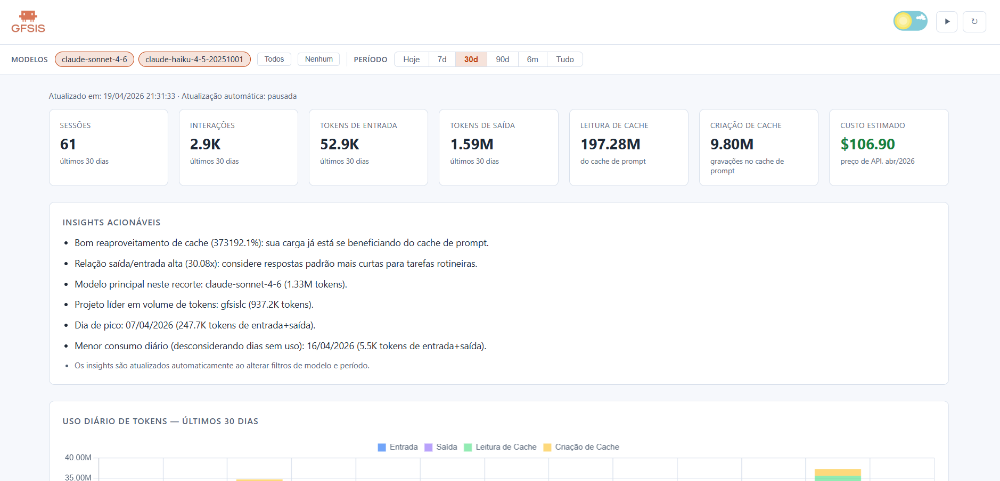

# Painel de Uso do Claude Code

[](LICENSE)
[](https://claude.ai/code)

**Assinantes Pro e Max recebem uma barra de progresso. Este painel mostra o cenário completo.**

O Claude Code grava logs locais detalhados de uso — contagem de tokens, modelos, sessões e projetos — independentemente do seu plano. Este dashboard lê esses logs e os transforma em gráficos e estimativas de custo. Funciona com planos API, Pro e Max.



---

## Novidades deste fork

- Possibilidade de **editar sessão**
- **Página de sessão** para exibir o **histórico da sessão**
- **Gráfico de tendência de consumo**
- **Quadro com insights**
- **Filtro por vários períodos**
- Inclusão de **logomarca** no projeto
- **Labels traduzidos para PT-BR**
- **Atualização automática a cada 30 segundos** no dashboard
- Suporte a **tema claro e escuro**
- Criação de **paginação na lista de sessões**

---

## O que este projeto monitora

Funciona nos planos **API, Pro e Max** — o Claude Code grava logs locais de uso independentemente do tipo de assinatura. Esta ferramenta lê esses logs e oferece visibilidade que a interface da Anthropic não fornece.

Captura uso de:
- **Claude Code CLI** (comando `claude` no terminal)
- **Extensão do VS Code** (barra lateral do Claude Code)
- **Sessões do Dispatched Code** (sessões roteadas pelo Claude Code)

**Não é capturado:**
- **Sessões Cowork** — são executadas no servidor e não gravam transcrições JSONL locais
- **Sessões do Claude Web e aplicativo desktop** — ainda não disponíveis nas transcrições locais do Claude Code

---

## Requisitos

- Python 3.8+
- Nenhum pacote de terceiros — usa apenas a biblioteca padrão (`sqlite3`, `http.server`, `json`, `pathlib`)

> Quem já usa Claude Code já tem Python instalado.

## Início rápido

Sem `pip install`, sem ambiente virtual, sem etapa de build.

### Windows
```
git clone https://github.com/phuryn/claude-usage
cd claude-usage
python cli.py dashboard
```

### macOS / Linux
```
git clone https://github.com/phuryn/claude-usage
cd claude-usage
python3 cli.py dashboard
```

---

## Uso

> No macOS/Linux, use `python3` em vez de `python` em todos os comandos abaixo.

```
# Varre arquivos JSONL e popula o banco de dados (~/.claude/usage.db)
python cli.py scan

# Mostra o resumo de uso de hoje por modelo (no terminal)
python cli.py today

# Mostra estatísticas de todo o período (no terminal)
python cli.py stats

# Mostra insights acionáveis (últimos 14 dias)
python cli.py insights

# Executa scan + abre o dashboard no navegador em http://localhost:8080
python cli.py dashboard

# Host e porta personalizados via variáveis de ambiente
HOST=0.0.0.0 PORT=9000 python cli.py dashboard

# Varre um diretório de projetos personalizado
python cli.py scan --projects-dir /caminho/para/transcripts
```

O scanner é incremental — ele rastreia o caminho e o tempo de modificação de cada arquivo, então rodar `scan` novamente é rápido e processa apenas arquivos novos ou alterados.

Por padrão, o scanner verifica `~/.claude/projects/` e também o diretório de integração Claude no Xcode (`~/Library/Developer/Xcode/CodingAssistant/ClaudeAgentConfig/projects/`), ignorando os que não existirem. Use `--projects-dir` para varrer um local personalizado.

---

## Como funciona

O Claude Code grava um arquivo JSONL por sessão em `~/.claude/projects/`. Cada linha é um registro JSON; registros do tipo `assistant` contêm:
- `message.usage.input_tokens` — tokens brutos do prompt
- `message.usage.output_tokens` — tokens gerados
- `message.usage.cache_creation_input_tokens` — tokens gravados no cache de prompt
- `message.usage.cache_read_input_tokens` — tokens servidos a partir do cache de prompt
- `message.model` — modelo utilizado (ex.: `claude-sonnet-4-6`)

O `scanner.py` processa esses arquivos e armazena os dados em um banco SQLite em `~/.claude/usage.db`.

O `dashboard.py` serve um dashboard de página única em `localhost:8080` com gráficos Chart.js (carregados via CDN). Ele se atualiza automaticamente a cada 30 segundos e suporta filtro por modelo com URLs que podem ser salvas/favoritadas. O endereço de bind e a porta podem ser sobrescritos com variáveis de ambiente `HOST` e `PORT` (padrões: `localhost`, `8080`).

---

## Estimativas de custo

Os custos são calculados com base nos **preços de API da Anthropic em abril de 2026** ([claude.com/pricing#api](https://claude.com/pricing#api)).

**Apenas modelos cujo nome contém `opus`, `sonnet` ou `haiku` são incluídos nos cálculos de custo.** Modelos locais, desconhecidos e quaisquer outros nomes de modelo são excluídos (exibidos como `n/a`).

| Modelo | Entrada | Saída | Escrita de cache | Leitura de cache |
|-------|-------|--------|------------|-----------|
| claude-opus-4-6 | $5.00/MTok | $25.00/MTok | $6.25/MTok | $0.50/MTok |
| claude-sonnet-4-6 | $3.00/MTok | $15.00/MTok | $3.75/MTok | $0.30/MTok |
| claude-haiku-4-5 | $1.00/MTok | $5.00/MTok | $1.25/MTok | $0.10/MTok |

> **Observação:** Estes são preços de API. Se você usa Claude Code via assinatura Max ou Pro, sua estrutura de custo real é diferente (assinatura, não por token).

---

## Arquivos

| Arquivo | Finalidade |
|------|---------|
| `scanner.py` | Processa transcrições JSONL e grava em `~/.claude/usage.db` |
| `dashboard.py` | Servidor HTTP + dashboard HTML/JS de página única |
| `cli.py` | Comandos `scan`, `today`, `stats`, `insights`, `dashboard` |
